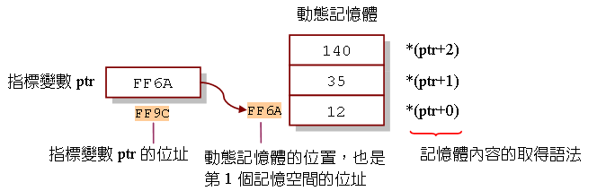
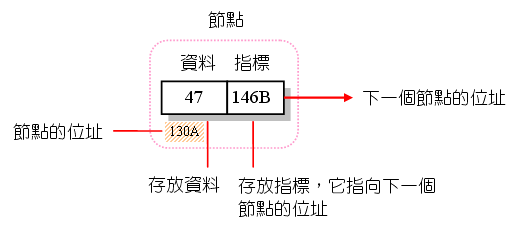
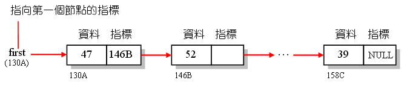
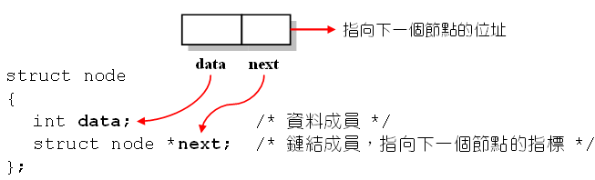
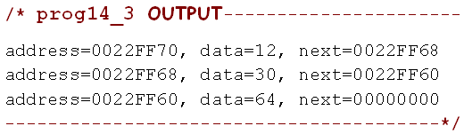
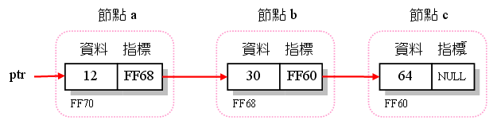

# 動態記憶體配置
#### malloc():
```
1. 要#include <stdlib.h>
2. malloc = memory allocation
```
用法:
```
指標函數=(指標變數所指向的型態 *)malloc(所需的記憶體空間)
         _____________________
         [將malloc()所傳回的位址強制轉換成指標變數
         所指向的型態]
```
```
1. malloc()函數會回傳「所配置記憶體的位址」,所以必須以一個指標變數來接受它。

2. 因為指標變數會有它所指向的型態,因此我們把malloc()所傳回的位址來進行型態轉換,
   再把它設給指標變數存放。

3. 如果配置失敗(如記憶空間不足),則malloc()傳回NULL。
```
如果要動態配置3個可存放整數的記憶空間,  
(假設每個整數佔4Bytes):  
```
int *ptr;        /* 宣告指向整數的指標ptr */
ptr=(*int)malloc(12);    /* 配置3*4個Bytes的記憶空間,
                         並把ptr指向它*/                            

```
由於不同的編譯程式可能會使用不同的位元組來存放整數,     
建議利用sizeof()指令來找出整數所佔的位元組,   
以提高程式碼的可攜性:   
```
ptr=(*int )malloc( 3*sizeof(int) );
```
#### 配置好後,指標ptr便會指向所配置之記憶空間的位址
#### (也就是這3個存放記憶體空間中,「第一個」記憶空間位址)
```
*ptr=12;          //將ptr所指向的第1個記憶空間設值為12
*(ptr+1)=35;      //第2個記憶空間設值為35
*(ptr+2)=140;     //第2個記憶空間設值為140
```
#### 第K個記憶空間的內容
```
可藉由 *(ptr+K-1) 來取得
```

#### free()
```
1. 要#include<stdlib.h>
2. 當記憶體不再使用,使用free()把它歸還給系統
```
用法:
```
free(指標變數);    //釋放由指標變數所指向的記憶空間
```
例:
```
free(ptr);    //釋放指標變數ptr所指向的記憶空間
```
#### 記憶體洩漏(memory leakage)
```
透過malloc()所分配出來的空間必須呼叫free()才能歸還給系統。
如果沒有用free()歸還,會造成佔用太多記憶體,
此現象為「記憶體洩漏」的錯誤。
```
#### 記憶空間分割失敗(segmentation fault)
```
如果空間已用free()歸還了,卻還嘗試著去使用那塊記憶空間,
則會發生「記憶空間分割失敗」的錯誤。
```
## prog14_1, 動態記憶體配置的範例
```
#include<stdio.h>
#include<stdlib.h>
int main(void)
{
   int *ptr,i;
   ptr=(int *) malloc(3*sizeof(int));   /* 配置3個存放整數的空間 */
   
   *ptr=12;			/* 把配置之記憶空間的第1個位置設值為12 */
   *(ptr+1)=35;		/* 把第2個位置設值為35 */
   *(ptr+2)=140;		/* 把第3個位置設值為140 */
   
   for(i=0;i<3;i++)
      printf("*ptr+%d=%d\n",i,*(ptr+i));   /* 印出存放的值 */
    
   free(ptr);           /* 釋放由ptr所指向的記憶空間 */

   system("pause");
   return 0;
} 
```
#### 利用指標操作存取記憶空間存放的值
```
其語法與利用指標來存取陣列的內容是一樣的
```
用法:
```
(結構指標名稱+i)->結構成員
```
## prog14_2, 配置記憶空間給結構變數
```
#include<stdio.h>
#include<stdlib.h>
int main(void)
{
   int num,i;
   struct student        	/* 定義結構student */
   {
      char name[10];
      int score;
   } *ptr;				/* 宣告指向結構student的指標ptr */

   printf("Number of student: ");
   scanf("%d",&num);
   
   ptr=(struct student *) malloc(num*sizeof(struct student));
   
   for(i=0;i<num;i++)
   {  
      fflush(stdin);     			/* 清空緩衝區的內容 */
      printf("name for student %d: ",i+1);
      gets((ptr+i)->name);			/* 將鍵入的字串寫入name成員 */
      printf("score for student %d: ",i+1);
      scanf("%d",&(ptr+i)->score);	/* 將鍵入的整數寫入score成員 */
   }
   for(i=0;i<num;i++)
      printf("%s: score=%d\n",(ptr+i)->name,(ptr+i)->score);

   free(ptr);     					/* 釋放記憶空間 */

   system("pause");
   return 0;
}
```
#### ->
```
在使用指標存取結構變數的成員時,
要利用「->」來連接欲存取的成員。
```
用法：
```
(結構指標名稱)->結構變數成員
```
### _重要: 如果取出某個結構變數成員時,在結構指標名稱前面「不需要」特別加上 依址取值運算子 『*』_  
#### 利用指標操作存取記憶空間存放的值
```
其語法與利用指標來存取陣列的內容是一樣的
```
用法:
```
(結構指標名稱+i)->結構成員
```
# 鏈結串列
#### 循序串列(sequential list)
```
存放元素的記憶體是循序的(即有先後次序)。
如:陣列(Array)
```
優點:
```
1.存取時方便、快速
2.較節省空間(不用存放指標)
```
缺點:
```
1.新增或刪除資料時,需大量搬移資料,降低執行效率
2.必須先宣告儲存空間,宣告後不能更改
```
#### 鏈結串列(linked list)
```
存放元素的記憶體並不連續,
而必須以指標將他們鏈結起來。
```
優點:
```
1.新增或刪除資料時時方便、快速
2.可以隨時增加或減少所需儲存空間
```
缺點:
```
1.存取時不方便
2.需存放指標的空間,造成使用空間較多
```
#### 鏈結串列表示法
```
1.由節點(node)組成
2.每個node是採用動態記憶體配置的方式來配置空間給它們
3.節點有兩個成員 1->資料 2->指標
4.指標指向了「下一個node的位置」
```

#### 首節點
```
首節點為鏈結串列的第一個節點,因為沒有任何的指標指向它,
所以設計一個「指標first｣,讓它指向首節點。
```
#### 終端節點
```
終端節點已是最後一個節點,把第二個成員設為「NULL」,
代表它後面已無任何節點。
```

## 以結構來表示鏈結串列
定義:
```
typedef struct node NODE;    //將struct node 定義為NODE型態

struct node{

    int data;     //資料成員
    struct node *next;   //鏈結成員,指向下一個節點的指標
}
```
  
  
宣告:
```
NODE node1,node2;    //宣告NODE型態的變數node1與node2
NODE *ptr;           //宣告指向NODE型態的指標ptr
```
## 鏈結串列實作範例
## prog14_3, 建立3節點的鏈結串列
```
#include<stdio.h>
#include<stdlib.h>
struct node
{
   int data;				  /* 資料成員  */
   struct node *next;		  /* 鏈結成員，存放指向下一個節點的指標  */
};
typedef struct node NODE;	  /* 將struct node定義成NODE型態 */

int main(void)
{
   NODE a,b,c;		/* 宣告a,b,c為NODE型態的變數 */
   NODE *ptr=&a;		/* 宣告ptr,並將它指向節點a */
   
   a.data=12;			/* 設定節點a的data成員為12 */
   a.next=&b;			/* 將節點a的next成員指向下一個節點，即b */
   b.data=30;			
   b.next=&c;			
   c.data=64;			
   c.next=NULL;		/* 將節點c的next成員設成NULL */
   
   while (ptr!=NULL)	/* 當ptr不是NULL時，則執行下列敘述 */
   {
      printf("address=%p, ",ptr);		/* 印出節點的位址 */
      printf("data=%d, ",ptr->data);	/* 印出節點的data成員 */
      printf("next=%p\n",ptr->next);	/* 印出下一個節點的位址 */
      ptr=ptr->next;					/* 將ptr指向下一個節點 */
   }
   
   system("pause");
   return 0;
}

```
  
  
#### 此題a,b,c節點的記憶體是以「靜態」的方式來配置
```
1.無法新增節點
2.被它所佔去的記憶體無法收回
```
#### %p
```
位址
```
## prog14_4, 以動態記憶體配置鏈結串列
```
#include<stdio.h>
#include<stdlib.h>
struct node
{
   int data;				  /* 資料成員  */
   struct node *next;		  /* 鏈結成員，存放指向下一個節點的指標  */
};
typedef struct node NODE;	  /* 將struct node定義成NODE型態 */

int main(void)
{
   int i,val,num;
   NODE *first,*current,*previous;    /* 建立3個指向NODE的指標 */
   printf("Number of nodes: ");
   scanf("%d",&num);			/* 輸入節點的個數 */
   for(i=0;i<num;i++)    
   {
      current=(NODE *) malloc(sizeof(NODE));  /* 建立新的節點 */
      printf("Data for node %d: ",i+1);
      scanf("%d",&(current->data));		/* 輸入節點的data成員 */
      if(i==0)					/* 如果是第一個節點 */
         first=current;			/* 把指標first指向目前的節點 */
      else
         previous->next=current;	/* 把前一個節點的next指向目前的節點 */
      current->next=NULL;		/* 把目前的節點的next指向NULL */
      previous=current;   		/* 把前一個節點設成目前的節點 */
   }
   current=first;			/* 設定current為第一個節點 */
   while (current!=NULL)	/* 如果還沒有到串列末端，則進行走訪的動作 */
   {
      printf("address=%p, ",current);	 /* 印出節點的位址 */
      printf("data=%d, ",current->data); /* 印出節點的data成員 */
      printf("next=%p\n",current->next);	 /* 印出節點的next成員 */
      current=current->next;	    /* 設定current指向下一個節點 */
   }
   system("pause");
   return 0;
}

```
#### 以上為鏈結串列的建立與走訪   
   
   
## 鏈結串列的操作
## linklist.h, 鏈結串列的標頭檔
```
struct node
{
   int data;				  /* 資料成員  */
   struct node *next;		  /* 鏈結成員，存放指向下一個節點的指標  */
};
typedef struct node NODE;	  /* 將struct node定義成NODE型態 */

NODE *createList(int *, int);			/* 串列建立函數 */
//接收:一個整數陣列,陣列元素的個數  回傳:串列第一個的節點位址

void printList(NODE *);				/* 串列列印函數 */
void freeList(NODE *);				/* 釋放串列記憶空間函數 */
void insertNode(NODE *,int );			/* 插入節點函數 */
NODE *searchNode(NODE *, int );		/* 搜尋節點函數 */
NODE *deleteNode(NODE *, NODE *);		/* 刪除節點函數 */


/*createList()串列建立函數:
接收一個整數陣列,以及陣列元素的個數,
傳回值為串列第一個節點的位址*/

NODE *createList(int *arr,int len){
    NODE *first,*current,*previous;
    int i;
    for(i=0;i<len;i++){
        
        current=(NODE*)malloc(sizeof(NODE));
        current->data=arr[i];
        if(i==0){
            first=current;
        }else{
            previous->next  =current;
        }
        
        current->next=NULL;
        previous=current;
        
    }
    
    return first;
}


/*printList() 串列列印函數:
接收一個指向串列第一個節點的指標,並利用走訪的過程把節點的每一個data成員都列印出來*/

void printList(NODE* first){  
    
    NODE* node=first;     //將node指向第一個節點
    if(first==NULL){                      //如果串列是空的
        printf("List is empty!\n");
    }else{
        while(node!=NULL){
            printf("%3d",node->data);    //如果串列非空,走訪串列並列出節點的data成員
            node=node->next;
        }
        printf("\n");
    }
}

/*freeList() 釋放記憶體空間函數:
接收一個指向串列第一個節點的指標*/

void freeList(NODE *first){
    NODE *current,*tmp;
    current = first;
    while(current!=NULL){
        tmp = current;
        current = current->next;
        free(tmp);
    }
}


```

函數實作:
```
#include <stdio.h>
#include <stdlib.h>
#include "linklist.h"
int main()
{
    NODE *first;
    int arr[]={24,23,54,42,62,72,85};
    first=createList(arr,7);
    printList(first);
    freeList(first);
    //printList(first);

    return 0;
}

```
