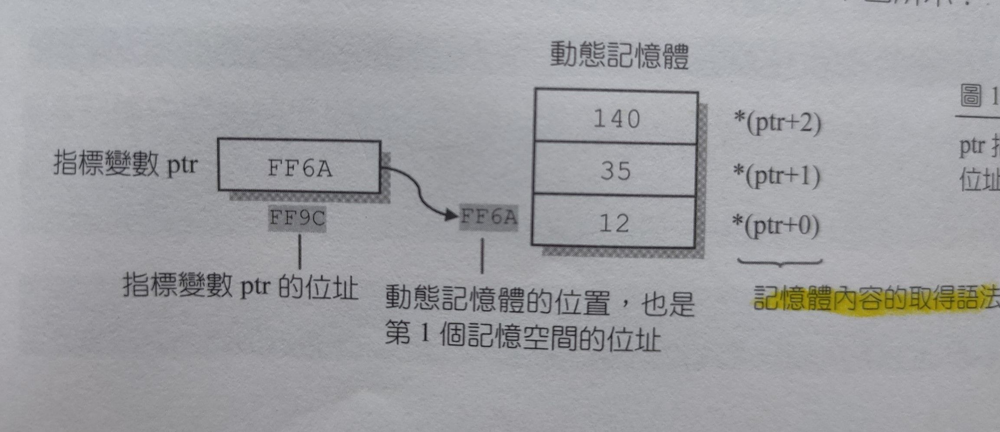

## 動態記憶體配置
#### malloc():
```
1. 要#include <stdlib.h>
2. malloc = memory allocation
```
用法:
```
指標函數=(指標變數所指向的型態 *)malloc(所需的記憶體空間)
         _____________________
         [將malloc()所傳回的位址強制轉換成指標變數
         所指向的型態]
```
```
1. malloc()函數會回傳「所配置記憶體的位址」,所以必須以一個指標變數來接受它。

2. 因為指標變數會有它所指向的型態,因此我們把malloc()所傳回的位址來進行型態轉換,
   再把它設給指標變數存放。

3. 如果配置失敗(如記憶空間不足),則malloc()傳回NULL。
```
如果要動態配置3個可存放整數的記憶空間,  
(假設每個整數佔4Bytes):  
```
int *ptr;        /* 宣告指向整數的指標ptr */
ptr=(*int)malloc(12);    /* 配置3*4個Bytes的記憶空間,
                         並把ptr指向它*/                            

```
由於不同的編譯程式可能會使用不同的位元組來存放整數,     
建議利用sizeof()指令來找出整數所佔的位元組,   
以提高程式碼的可攜性:   
```
ptr=(*int )malloc( 3*sizeof(int) );
```
#### 配置好後,指標ptr便會指向所配置之記憶空間的位址
#### (也就是這3個存放記憶體空間中,「第一個」記憶空間位址)
```
*ptr=12;          //將ptr所指向的第1個記憶空間設值為12
*(ptr+1)=35;      //第2個記憶空間設值為35
*(ptr+2)=140;     //第2個記憶空間設值為140
```
#### 第K個記憶空間的內容
```
可藉由 *(ptr+K-1) 來取得
```

#### free()
```
1. 要#include<stdlib.h>
2. 當記憶體不再使用,使用free()把它歸還給系統
```
用法:
```
free(指標變數);    //釋放由指標變數所指向的記憶空間
```
例:
```
free(ptr);    //釋放指標變數ptr所指向的記憶空間
```
#### 記憶體洩漏(memory leakage)
```
透過malloc()所分配出來的空間必須呼叫free()才能歸還給系統。
如果沒有用free()歸還,會造成佔用太多記憶體,
此現象為「記憶體洩漏」的錯誤。
```
#### 記憶空間分割失敗(segmentation fault)
```
如果空間已用free()歸還了,卻還嘗試著去使用那塊記憶空間,
則會發生「記憶空間分割失敗」的錯誤。
```
## prog14_1, 動態記憶體配置的範例
```
#include<stdio.h>
#include<stdlib.h>
int main(void)
{
   int *ptr,i;
   ptr=(int *) malloc(3*sizeof(int));   /* 配置3個存放整數的空間 */
   
   *ptr=12;			/* 把配置之記憶空間的第1個位置設值為12 */
   *(ptr+1)=35;		/* 把第2個位置設值為35 */
   *(ptr+2)=140;		/* 把第3個位置設值為140 */
   
   for(i=0;i<3;i++)
      printf("*ptr+%d=%d\n",i,*(ptr+i));   /* 印出存放的值 */
    
   free(ptr);           /* 釋放由ptr所指向的記憶空間 */

   system("pause");
   return 0;
} 
```
#### 利用指標操作存取記憶空間存放的值
```
其語法與利用指標來存取陣列的內容是一樣的
```
## prog14_2, 配置記憶空間給結構變數
```
#include<stdio.h>
#include<stdlib.h>
int main(void)
{
   int num,i;
   struct student        	/* 定義結構student */
   {
      char name[10];
      int score;
   } *ptr;				/* 宣告指向結構student的指標ptr */

   printf("Number of student: ");
   scanf("%d",&num);
   
   ptr=(struct student *) malloc(num*sizeof(struct student));
   
   for(i=0;i<num;i++)
   {  
      fflush(stdin);     			/* 清空緩衝區的內容 */
      printf("name for student %d: ",i+1);
      gets((ptr+i)->name);			/* 將鍵入的字串寫入name成員 */
      printf("score for student %d: ",i+1);
      scanf("%d",&(ptr+i)->score);	/* 將鍵入的整數寫入score成員 */
   }
   for(i=0;i<num;i++)
      printf("%s: score=%d\n",(ptr+i)->name,(ptr+i)->score);

   free(ptr);     					/* 釋放記憶空間 */

   system("pause");
   return 0;
}
```
